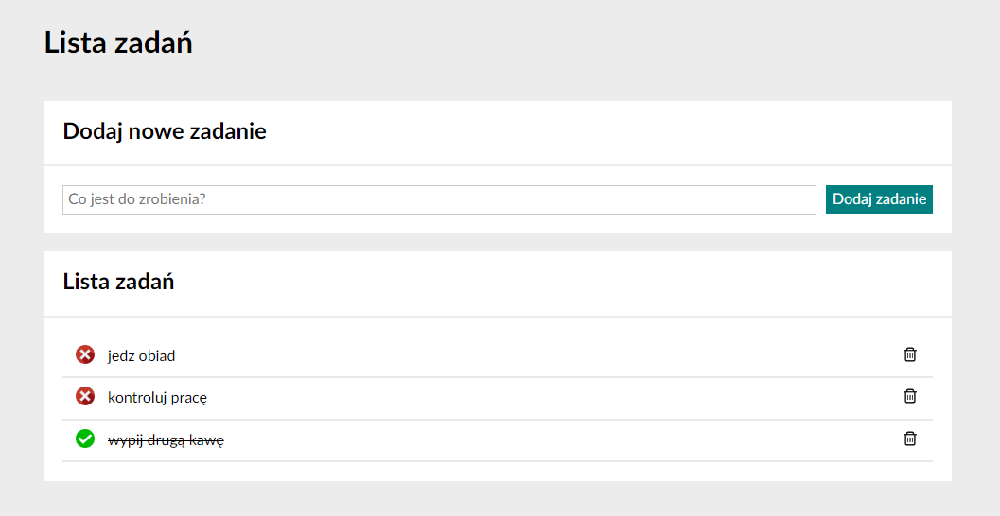

# taskList
Welcome to the little app/site to make a task list, only front end, without database to save it.
## possibilities
it's able to add new task, check if it's done or not yet and you can delete it.
You are unable to edit - in order to edit need to delete and add again. You can't also change the order
## what i trained here?
there was tutorial on JS + HTML how to write an app like that, I upgraded JS and HTML a little, but most of my job here was CSS and making it look nice, modern and responsive.

```CSS
@media screen and (max-width: 900px) {
    .title {
        width: 100%;
        margin: 1px;
    }

    .addNewTask {
        width: 100%;
    }

    .taskList {
        width: 100%;
    }

    .container {
        margin: 10%;
    }
}
```

I also wanted to train my understanding of grid, flexbox and media query
```CSS
.container {

    margin-top: 40px;
    max-width: 1200px;
    margin: 100px;

    display: flex;
    flex-direction: column;
    justify-content: center;
    align-items: center;

}
```
## Screenshot of the app:

## demo of the website:
Try the [demo website here](https://wojciechluczak.github.io/taskList)
## Technologies used to make the page:
- Javascript 
- CSS
- HTML
